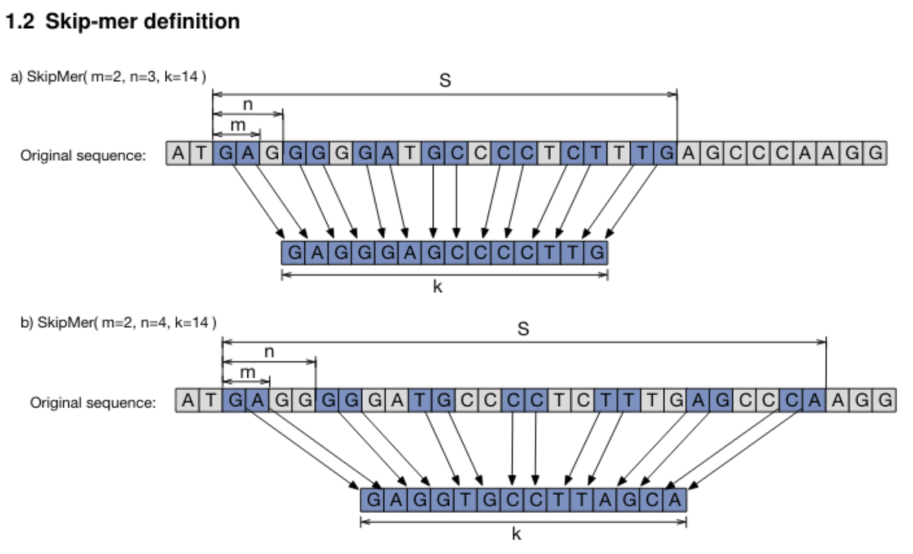

```@meta
CurrentModule = BioSequences
DocTestSetup = quote
    using BioSequences
end
```

## Skipmers and Kmers


### What are Skipers and Kmers?

Bioinformatic analyses make extensive use of kmers.
Kmers are contiguous sub-strings of k nucleotides of some ref sequence. 

They are used extensively in bioinformatic analyses as an informational unit.
This concept popularised by short read assemblers. 
Analyses within the kmer space benefit from a simple formulation of the sampling
problem and direct in-hash comparisons.

However, for some analyses, the contiguous nature of kmers imposes limitations.
A single base difference, due to real biological variation or a sequencing error,
affects all k-mers crossing that position thus impeding direct analyses by identity.
Also, given the strong interdependence of local sequence, contiguous sections
capture less information about genome structure, and are thus more affected by
sequence repetition. 

Skipmers are a generalisation of the concept of a kmer.
They are created using a cyclic pattern of used-and-skipped positions which
achieves increased entropy and tolerance to nucleotide substitution differences
by following some simple rules.

Skipmers preserve many of the elegant properties of kmers such as reverse
complementability and existence of a canonical representation.
Also, using cycles of three greatly increases the power of direct intersection
between the genomes of different organisms by grouping together the more conserved 
nucleotides of the protein-coding regions.

*How are Skipmers generated?*

A skipmer is a simple cyclic q-gram that includes _m_ out of every _n_ bases
until a total of _k_ bases is reached. 

This is illustrated in the figure below (from [this paper](https://www.biorxiv.org/content/biorxiv/early/2017/08/23/179960.full.pdf).):



To maintain cyclic properties and the existence of the reverse-complement as a
skipmer defined by the same function, _k_ must be a multiple of _m_.
This also enables the existence of a canonical representation for each skipmer,
defined as the lexicographically smaller of the forward and reverse-complement 
representations.
Defining _m_, _n_ and _k_ fixes a value for _S_, the total span of the skipmer,
given by: 

```math
S = n * (\frac{k}{m} - 1) + m
```

!!! note
    
    It is important to note that kmers are a sub-class of skipmers.
    A skipmer with _m = n_ will use all contiguous _k_ nucleotides, which makes
    it a kmer.


### The Skipmer type in BioSequences

As Skipmers and Kmers are typically short sequences.
They can be packed into machine integers allowing extremely efficient code.
The `BioSequences` package provides the `Skipmer` type, which efficiently
represents such short sequences in unsigned integers. Besides being fixed length,
`Skipmer` types, unlike other sequence types cannot contain ambiguous symbols like
'N'.

The `Skipmer{U, A, M, N, K}` type is parameterized on the type of unsigned
integer that contains the packed nucleotides (`U`), the alphabet (`A`, either 
`DNAAlphabet{2} or RNAAlphabet{2}`), the number of used bases per cycle: _m_ (`M`),
the cycle length: _n_, (`N`), and the length of the skipmer: _k_ (`K`).
    
5 parameters is quite a lot, so for ease of writing code, some type aliases are
defined:

Some shorthands for writing code using Skipmers:

`DNASkipmer{M, N, K} = Skipmer{UInt64, DNAAlphabet{2}, M, N, K}`

`RNASkipmer{M, N, K} = Skipmer{UInt64, RNAAlphabet{2}, M, N, K}`

`BigDNASkipmer{M, N, K} = Skipmer{UInt128, DNAAlphabet{2}, M, N, K}`

`BigRNASkipmer{M, N, K} = Skipmer{UInt128, RNAAlphabet{2}, M, N, K}`

Some shorthands for writing code that uses Kmers.

`Kmer{U,A,K} = Skipmer{U, A, 1, 1, K}`

`DNAKmer{K} = Kmer{UInt64, DNAAlphabet{2}, K}`

`RNAKmer{K} = Kmer{UInt64, RNAAlphabet{2}, K}`

`BigDNAKmer{K} = Kmer{UInt128, DNAAlphabet{2}, K}`

`BigRNAKmer{K} = Kmer{UInt128, RNAAlphabet{2}, K}`


### Creating Skiper types

You can create `Skipmers` and `Kmers` from nucleic acids:

```jldoctest
julia> DNAKmer{5}(DNA_A, DNA_A, DNA_G, DNA_C, DNA_G)
DNA 5-mer:
AAGCG

julia> DNAKmer(DNA_A, DNA_A, DNA_G, DNA_C, DNA_G)
DNA 5-mer:
AAGCG

julia> DNASkipmer{2, 3, 5}(DNA_A, DNA_A, DNA_G, DNA_C, DNA_G)
DNA Skip(2, 3, 5)-mer:
AAGCG

julia> Skipmer{UInt64, DNAAlphabet{2}, 2, 3, 5}(DNA_A, DNA_A, DNA_G, DNA_C, DNA_G)
DNA Skip(2, 3, 5)-mer:
AAGCG
```

You can also create Skipmers from `Strings` and other `BioSequence` types:

```jldoctest
julia> DNAKmer{8}("ATCGATCG")
DNA 8-mer:
ATCGATCG

julia> # The following works, but is not type-stable...

julia> DNAKmer("ATCGATCG")
DNA 8-mer:
ATCGATCG

julia> rnaseq = rna"AUCGAUCG"
8nt RNA Sequence:
AUCGAUCG

julia> RNAKmer{8}(rnaseq)
RNA 8-mer:
AUCGAUCG

julia> # The following works, but is not type-stable...

julia> RNAKmer(rnaseq)
RNA 8-mer:
AUCGAUCG

``` 

You can also convert `Skipmer`s back to other `BioSequence` types and `String`s:

```jldoctest
julia> skipmer = DNAKmer(DNA_A, DNA_G, DNA_T, DNA_T, DNA_A, DNA_G)
DNA 6-mer:
AGTTAG

julia> String(skipmer)
"AGTTAG"

julia> DNASequence(skipmer)
6nt DNA Sequence:
AGTTAG
```

### Compatible generic functions

The following generic functions work with `Skipmer` types.
Many more methods in the julia standard library may work with
these types as a result.  

#### Predicates
- [`Base.cmp`]
- [`Base.isless`]
- [`Base.isempty`]
- [`Base.isequal`]
- [`isrepetitive`](@ref)
- [`ispalindromic`](@ref)
- [`hasambiguity`](@ref)

#### Operations
- [`Base.count`]
- [`Base.length`]
- [`Base.findnext`]
- [`Base.findprev`]
- [`Base.findfirst`]
- [`Base.findlast`]
- [`mismatches`](@ref)
- [`gc_content`](@ref)
- [`count_gc`](@ref)
- [`count_a`](@ref)
- [`count_c`](@ref)
- [`count_g`](@ref)
- [`count_t`](@ref)

#### Transformations
- [`complement`](@ref)
- [`reverse`](@ref)
- [`reverse_complement`](@ref)
- [`canonical`](@ref)
- [`shuffle`](@ref)

#### Printing
- [`Base.summary`]
- [`Base.print`]
- [`Base.show`]
